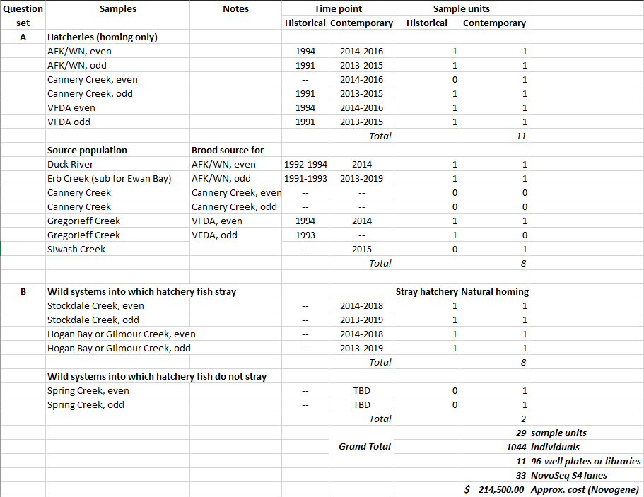

# Setup

Clean directory and load packages
```{r setup, include=FALSE}
rm(list=ls())

knitr::opts_chunk$set(echo = TRUE)

if(!require("pacman")) install.packages("pacman"); library(pacman)

pacman::p_load(
  tidyverse,
  lubridate,
  DT
)

# source("~/../R/Functions.GCL.R")  # develop branch!!!
```

Helper function for converting a list of `sillyvec` on clipboard to separated by ";" for *OceanAK* lookup and pasted back to clipboard
```{r}
sillyvec <- readClipboard()
sillyvec <- setdiff(sillyvec, c("PSTOCK16", "PSTOCK17", "PHOGAN16", "PHOGAN17"))
writeClipboard(paste0(unique(sillyvec), collapse = ";"))
```

# Objective

The objective of this notebooks is to create an extraction list for our collaborative PWS Pink Salmon whole genome re-sequencing (WGR) project with the Christie Lab at  Purdue University. The study design for this extraction list comes from:

    V:\Documents\5_Coastwide\Multispecies\AHRP\Pink Salmon Disaster Funding\Round2\Objective 11 PWS WGR\Sample Units.xlsx
    Sheet 2

  * 29 sample units  
  * 36 individuals per samples unit  
  * 1,044 total individuals  

# Background

This project is using leftover Pink Salmon Disaster 2016 funds to try to address questions about potential genetic mechanisms causing reduced RRS. This project is broken into two main questions:  

  * A - genomic evidence for domestication selection over time (comparing historical vs. contemporary vs. brood source collections)  
  * B - genomic differences between hatchery strays vs. natural-origin homing individuals

## Sample Units



Using "output/PWS Pink Salmon WGR Extraction List.xlsx" and "output/extraction_selection.xlsx" to hand-pick most extractions

**Updating to replace Gregorieff Creek 1993 and Siwash Creek 2015 as the VFDA brood source collections for the odd-lineage**

Replacing with Duck River 191 and 2013. Duck River was not the brood source for VFDA, but it is the closest stream distance-wise. Gregorieff 1993 only had 16 alevin samples and Siwash 2015 did not have paired otolith data (so probably a bunch of strays mixed in).

# Duck River 2014 + Gregorieff Creek 2014

Need the tissue information from *LOKI* tissue table
Need the sex data from *LOKI* fish table
Need the otolith data from *warehouse*

Pick fish and format for extraction (use PWS Pink as a template)

## Import Data

### LOKI Tissue Table

DWP information and tissue missing data lives here...
```{r}
(loki_tissue_og <- readr::read_csv(file = "../data/LOKI_tissue_GEN_SAMPLED_FISH_TISSUE.csv"))
```

Modify, filter for silly codes of interest and remove any fish with knwon missing tissues
```{r}
(
  loki_tissue <- loki_tissue_og %>%
    dplyr::filter(
      `Silly Code` %in% c("PDUCK14E", "PDUCK14L", "PGREG14E", "PGREG14L"),
      PK_TISSUE_TYPE == "Heart",
      is.na(IS_MISSING_PAIRED_DATA_EXISTS),
      is.na(WELL_HAS_MORE_THAN_ONE_SAMPLE)
    ) %>%
    dplyr::rename(
      silly = `Silly Code`,
      fish_id = FK_FISH_ID,
      tissue_type = PK_TISSUE_TYPE,
      dwp_barcode = DNA_TRAY_CODE,
      dwp_well = DNA_TRAY_WELL_CODE
    ) %>%
    tidyr::unite(
      col = "silly_source",
      c(silly, fish_id),
      sep = "_",
      remove = FALSE
    ) %>%
    dplyr::select(
      silly,
      fish_id,
      silly_source,
      tissue_type,
      dwp_barcode,
      dwp_well
    )
)
```

### LOKI Fish Table

Sex data lives here...
```{r}
(loki_fish_og <- readr::read_csv(file = "../data/LOKI_fish_ASL Import.csv"))
```

Modify, filter for silly codes of interest
```{r}
(
  loki_fish <- loki_fish_og %>%
    dplyr::filter(
      `Silly Code` %in% c("PDUCK14E", "PDUCK14L", "PGREG14E", "PGREG14L")
    ) %>%
    dplyr::rename(
      silly = `Silly Code`,
      fish_id = `Fish ID`,
      sex = Sex
    ) %>%
    tidyr::unite(
      col = "silly_source",
      c(silly, fish_id),
      sep = "_",
      remove = TRUE
    ) %>%
    dplyr::select(silly_source, sex)
)
```

### Salmon Biological Data

Otolith read data lives here...
```{r}
(oceanak_og <- readr::read_csv(file = "../data/Duck 2014 and Gregorieff 2014 AHRP Salmon Biological Data 20220318_160209.csv"))
```

Modify, filter for silly codes of interest and tissue type "Otolith"
```{r}
(
  oceanak <- oceanak_og %>%
    dplyr::filter(
      SILLY_CODE %in% c("PDUCK14E", "PDUCK14L", "PGREG14E", "PGREG14L"),
      TISSUE_TYPE == "Otolith"
    ) %>%
    dplyr::rename(
      silly = SILLY_CODE,
      fish_id = FISH_ID,
      tissue_type = TISSUE_TYPE,
      dwp_barcode = DNA_TRAY_CODE,
      dwp_well = DNA_TRAY_WELL_CODE,
      otolith_mark_present = OTOLITH_MARK_PRESENT
    ) %>%
    tidyr::unite(
      col = "silly_source",
      c(silly, fish_id),
      sep = "_",
      remove = FALSE
    ) %>%
    dplyr::select(
      silly_source,
      otolith_mark_present
    )
)
```

## Join

Join all three of these data sources into something useful, then filter by our collections (Duck and Gregorioff 2014), non-missing tissue, natural-origin, split evenly across silly codes and sexes.
```{r}
(join_duck_greg <- loki_tissue %>% 
   dplyr::left_join(loki_fish, by = "silly_source") %>% 
   dplyr::left_join(oceanak, by = "silly_source")
)
```

## Extraction Selection

From each silly, grab the first 9 fish from each sex that are not otolith marked (i.e. natural-origin fish). Total of 18 fish per silly, 36 fish per sampling unit (early and late are still one sampling unit).
```{r}
(
  extraction_duck_greg <- join_duck_greg %>%
    dplyr::filter(otolith_mark_present == "NO",
                  sex != "U") %>%
    dplyr::group_by(silly, sex) %>%
    dplyr::slice_min(order_by = fish_id, n = 9) %>%
    dplyr::ungroup() %>% 
    dplyr::arrange(silly, fish_id) %>% 
    dplyr::select(
      silly_source,
      silly,
      fish_id,
      dwp_barcode,
      dwp_well,
      tissue_type,
      sex,
      otolith_mark_present
    )
)
```

Write it out for posterity
```{r}
readr::write_csv(x = extraction_duck_greg, file = "../output/extraction_selection_PDUCK14E_PDUCK14L_PGREG14E_PGREG14L.csv")
```

# Erb 1991

## Import Data

### LOKI Tissue Table

DWP information and tissue missing data lives here...
```{r}
(loki_tissue_og <- readr::read_csv(file = "../data/LOKI_tissue_GEN_SAMPLED_FISH_TISSUE.csv"))
```

Modify, filter for silly codes of interest and remove any fish with knwon missing tissues
```{r}
(
  loki_tissue <- loki_tissue_og %>%
    dplyr::filter(
      `Silly Code` %in% c("PERBE91T", "PERBL91T"),
      PK_TISSUE_TYPE == "Heart",
      is.na(IS_MISSING_PAIRED_DATA_EXISTS),
      is.na(WELL_HAS_MORE_THAN_ONE_SAMPLE)
    ) %>%
    dplyr::rename(
      silly = `Silly Code`,
      fish_id = FK_FISH_ID,
      tissue_type = PK_TISSUE_TYPE,
      dwp_barcode = DNA_TRAY_CODE,
      dwp_well = DNA_TRAY_WELL_CODE
    ) %>%
    tidyr::unite(
      col = "silly_source",
      c(silly, fish_id),
      sep = "_",
      remove = FALSE
    ) %>%
    dplyr::select(
      silly,
      fish_id,
      silly_source,
      tissue_type,
      dwp_barcode,
      dwp_well
    )
)
```

Wait, what? No tissues for PERBL91T....

Cool, no known missing, grab first 36 from PERBE91T until we figure out PERBL91T.

# Erb 2017

Need the tissue information from *LOKI* tissue table
Need the sex and otolith data from *warehouse*

Pick fish and format for extraction (use PWS Pink as a template)

## Import Data

### LOKI Tissue Table

DWP information and tissue missing data lives here...
```{r}
(loki_tissue_og <- readr::read_csv(file = "../data/LOKI_tissue_GEN_SAMPLED_FISH_TISSUE_PERB17_20220321_150821.csv"))
```

Modify, filter for silly codes of interest and remove any fish with known missing tissues
```{r}
erb_2017_oto_fish_ids <-
  dplyr::filter(.data = loki_tissue_og, PK_TISSUE_TYPE == "Otolith") %>% pull(FK_FISH_ID)

(
  loki_tissue <- loki_tissue_og %>%
    dplyr::filter(
      FK_FISH_ID %in% erb_2017_oto_fish_ids,
      PK_TISSUE_TYPE == "Heart-bulbus arteriosus",
      IS_MISSING_PAIRED_DATA_EXISTS == 0,
      WELL_HAS_MORE_THAN_ONE_SAMPLE == 0
    ) %>%
    dplyr::rename(
      silly = SILLY_CODE,
      fish_id = FK_FISH_ID,
      tissue_type = PK_TISSUE_TYPE,
      dwp_barcode = DNA_TRAY_CODE,
      dwp_well = DNA_TRAY_WELL_CODE
    ) %>%
    tidyr::unite(
      col = "silly_source",
      c(silly, fish_id),
      sep = "_",
      remove = FALSE
    ) %>%
    dplyr::select(
      silly,
      fish_id,
      silly_source,
      tissue_type,
      dwp_barcode,
      dwp_well
    )
)
```

### Salmon Biological Data

Sex and otolith read data lives here...
```{r}
(oceanak_og <- readr::read_csv(file = "../data/Erb 2017 AHRP Salmon Biological Data 20220321_151027.csv"))
```

Modify, filter for silly codes of interest and tissue type "Heart-bulbus arteriosus"
```{r}
(
  oceanak <- oceanak_og %>%
    dplyr::filter(
      TISSUE_TYPE == "Heart-bulbus arteriosus"
    ) %>%
    dplyr::rename(
      silly = SILLY_CODE,
      fish_id = FISH_ID,
      tissue_type = TISSUE_TYPE,
      dwp_barcode = DNA_TRAY_CODE,
      dwp_well = DNA_TRAY_WELL_CODE,
      sample_date = SAMPLE_DATE,
      sex = SEX,
      otolith_mark_present = OTOLITH_MARK_PRESENT
    ) %>%
    dplyr::mutate(sample_date = lubridate::ymd(sample_date)) %>% 
    tidyr::unite(
      col = "silly_source",
      c(silly, fish_id),
      sep = "_",
      remove = FALSE
    ) %>%
    dplyr::select(
      silly_source,
      sample_date,
      sex,
      otolith_mark_present
    )
)
```

## Join

Join all two of these data sources into something useful, then filter by our collections (Duck and Gregorioff 2014), non-missing tissue, natural-origin, split evenly across silly codes and sexes.
```{r}
(join_duck_greg <- loki_tissue %>% 
   dplyr::left_join(oceanak, by = "silly_source")
)
```

## Extraction Selection

From each silly, grab the first 9 fish from each sex that are not otolith marked (i.e. natural-origin fish). Total of 18 fish per silly, 36 fish per sampling unit (early and late are still one sampling unit).
```{r}
(
  extraction_erb_2017 <- join_duck_greg %>%
    dplyr::filter(otolith_mark_present == "NO",
                  sex != "U") %>%
    dplyr::group_by(silly, sex) %>%
    dplyr::slice_sample(n = 18) %>%
    dplyr::ungroup() %>% 
    dplyr::arrange(silly, fish_id) %>% 
    dplyr::select(
      silly_source,
      silly,
      fish_id,
      dwp_barcode,
      dwp_well,
      tissue_type,
      sample_date,
      sex,
      otolith_mark_present
    )
)
```

Write it out for posterity
```{r}
readr::write_csv(x = extraction_erb_2017, file = "../output/extraction_selection_PERB17.csv")
```

# Duck River 2013

Got sex data from Wei on 3/21/22

Need the tissue information from *LOKI* tissue table
Need the sex data from *LOKI* fish table
Need the otolith data from *warehouse*

Pick fish and format for extraction (use PWS Pink as a template)

## Import Data

### LOKI Tissue Table

DWP information and tissue missing data lives here...
```{r}
(loki_tissue_og <- readr::read_csv(file = "../data/LOKI_tissue_GEN_SAMPLED_FISH_TISSUE_PDUCK13_20220322_103543.csv"))
```

Modify, filter for silly codes of interest and remove any fish with knwon missing tissues
```{r}
(
  loki_tissue <- loki_tissue_og %>%
    dplyr::filter(
      SILLY_CODE %in% c("PDUCK13"),
      PK_TISSUE_TYPE == "Axillary Process",
      is.na(IS_MISSING_PAIRED_DATA_EXISTS),
      is.na(WELL_HAS_MORE_THAN_ONE_SAMPLE)
    ) %>%
    dplyr::rename(
      silly = SILLY_CODE,
      fish_id = FK_FISH_ID,
      tissue_type = PK_TISSUE_TYPE,
      dwp_barcode = DNA_TRAY_CODE,
      dwp_well = DNA_TRAY_WELL_CODE
    ) %>%
    tidyr::unite(
      col = "silly_source",
      c(silly, fish_id),
      sep = "_",
      remove = FALSE
    ) %>%
    dplyr::select(
      silly,
      fish_id,
      silly_source,
      tissue_type,
      dwp_barcode,
      dwp_well
    )
)
```

### LOKI Fish Table

Sex data lives here...
```{r}
(loki_fish_og <- readr::read_csv(file = "../data/LOKI_tissue_GEN_SAMPLED_FISH_PDUCK13_20220322_104648.csv"))
```

Modify, filter for silly codes of interest
```{r}
(
  loki_fish <- loki_fish_og %>%
    dplyr::filter(
      SILLY_CODE == "PDUCK13"
    ) %>%
    dplyr::rename(
      silly = SILLY_CODE,
      fish_id = FISH_ID,
      sex = SEX
    ) %>%
    tidyr::unite(
      col = "silly_source",
      c(silly, fish_id),
      sep = "_",
      remove = TRUE
    ) %>%
    dplyr::select(silly_source, sex)
)
```

### Salmon Biological Data

Otolith read data lives here...
```{r}
(oceanak_og <- readr::read_csv(file = "../data/Duck 2013 AHRP Salmon Biological Data 20220322_103611.csv"))
```

```{r}
oceanak_og %>% 
  count(SILLY_CODE, SAMPLE_DATE)
```

Modify, filter for silly codes of interest and tissue type "Otolith"
```{r}
(
  oceanak <- oceanak_og %>%
    dplyr::filter(
      SILLY_CODE == "PDUCK13",
      TISSUE_TYPE == "Otolith"
    ) %>%
    dplyr::rename(
      silly = SILLY_CODE,
      fish_id = FISH_ID,
      tissue_type = TISSUE_TYPE,
      dwp_barcode = DNA_TRAY_CODE,
      dwp_well = DNA_TRAY_WELL_CODE,
      otolith_mark_present = OTOLITH_MARK_PRESENT
    ) %>%
    tidyr::unite(
      col = "silly_source",
      c(silly, fish_id),
      sep = "_",
      remove = FALSE
    ) %>%
    dplyr::select(
      silly_source,
      otolith_mark_present
    )
)
```

```{r}
oceanak %>% 
  count(otolith_mark_present)
```


## Join

Join all three of these data sources into something useful, then filter by our collections (Duck 13), non-missing tissue, natural-origin, split evenly across silly codes and sexes.
```{r}
(join_duck_2013 <- loki_tissue %>% 
   dplyr::left_join(loki_fish, by = "silly_source") %>% 
   dplyr::left_join(oceanak, by = "silly_source")
)
```

## Extraction Selection

From each silly, grab the first 18 fish from each sex that are not otolith marked (i.e. natural-origin fish). Total of 36 fish per silly, 36 fish per sampling unit.
```{r}
(
  extraction_duck_2013 <- join_duck_2013 %>%
    dplyr::filter(otolith_mark_present == "NO",
                  sex != "U") %>%
    dplyr::group_by(silly, sex) %>%
    dplyr::slice_min(order_by = fish_id, n = 18) %>%
    dplyr::ungroup() %>% 
    dplyr::arrange(silly, fish_id) %>% 
    dplyr::select(
      silly_source,
      silly,
      fish_id,
      dwp_barcode,
      dwp_well,
      tissue_type,
      sex,
      otolith_mark_present
    )
)
```

Write it out for posterity
```{r}
readr::write_csv(x = extraction_duck_2013, file = "../output/extraction_selection_PDUCK13.csv")
```

# Stockdale 2016

Need hatchery strays and natural-origin homing fish (i.e. those with natural-origin parents)

## Natural-origin Homing

Split by sex, sampled throughout the season

### Import Data

Bad practice, but I'm going to grab output data from PWS-Pink-Parentage
```{r}
(
  all_streams_parents_paired_14_16_cross <-
    readr::read_csv(file = "../../PWS Pink/GitHub-PWS-Pink-Parentage/Stockdale_Hogan_Gilmour_Paddy_Erb/all_streams_parents_paired_14_16_cross.csv")
)

(
  all_streams_parents_paired_14_16 <-
    readr::read_csv(file = "../../PWS Pink/GitHub-PWS-Pink-Parentage/Stockdale_Hogan_Gilmour_Paddy_Erb/all_streams_parents_paired_14_16.csv")
)
```

### Choose from NN crosses

Filter for Stockdale and only 
```{r}
stockdale_2016_natural_selection_NN_cross <- all_streams_parents_paired_14_16_cross %>% 
  dplyr::filter(stream_off == stream_sire,
                stream_off == "Stockdale",
                origin_sire == origin_dam,
                origin_sire == "Natural") %>% 
  dplyr::group_by(mating_id) %>% 
  dplyr::slice_sample(n = 1, replace = FALSE) %>% 
  dplyr::group_by(parent_id_sire) %>% 
  dplyr::slice_sample(n = 1, replace = FALSE) %>% 
  dplyr::group_by(parent_id_dam) %>% 
  dplyr::slice_sample(n = 1, replace = FALSE) %>% 
  dplyr::ungroup() 

stockdale_2016_natural_selection_NN_cross %>% 
  dplyr::count(sex_off)
```

Modify for extraction format
```{r}
(
  stockdale_2016_natural_selection_NN_cross <-
    stockdale_2016_natural_selection_NN_cross %>%
    dplyr::rename(
      silly = silly_off,
      fish_id = fish_id_off,
      dwp_barcode = dna_tray_code_off,
      dwp_well = dna_tray_well_code_off,
      sample_date = date_off,
      sex = sex_off,
      otolith_mark_present = otolith_mark_present_off
    ) %>%
    dplyr::mutate(tissue_type = "Heart-bulbus arteriosus") %>%
    tidyr::unite(
      col = "silly_source",
      c(silly, fish_id),
      sep = "_",
      remove = FALSE
    ) %>%
    dplyr::arrange(silly, fish_id) %>%
    dplyr::select(
      silly_source,
      silly,
      fish_id,
      dwp_barcode,
      dwp_well,
      tissue_type,
      sample_date,
      sex,
      otolith_mark_present
    )
)
```

Still need 1 more Male, pick from dyad data

### Chose from N dyads

```{r}
(
  stockdale_2016_natural_selection_N_dyad <-
    all_streams_parents_paired_14_16 %>%
    dplyr::rename(
      silly = silly_off,
      fish_id = fish_id_off,
      dwp_barcode = dna_tray_code_off,
      dwp_well = dna_tray_well_code_off,
      sample_date = date_off,
      sex = sex_off,
      otolith_mark_present = otolith_mark_present_off
    ) %>%
    dplyr::mutate(tissue_type = "Heart-bulbus arteriosus") %>%
    tidyr::unite(
      col = "silly_source",
      c(silly, fish_id),
      sep = "_",
      remove = FALSE
    ) %>%
    dplyr::filter(
      stream_off == stream_par,
      stream_off == "Stockdale",
      origin_par == "Natural",
      sex == "Male",
      !(
        silly_source %in% stockdale_2016_natural_selection_NN_cross$silly_source
      ),
      !(
        parent_id %in% all_streams_parents_paired_14_16_cross$parent_id_dam
      ),
      !(
        parent_id %in% all_streams_parents_paired_14_16_cross$parent_id_sire
      )
    ) %>%
    dplyr::group_by(sex) %>%
    dplyr::slice_sample(n = 1, replace = FALSE) %>%
    dplyr::ungroup() %>% 
    dplyr::arrange(silly, fish_id) %>%
    dplyr::select(
      silly_source,
      silly,
      fish_id,
      dwp_barcode,
      dwp_well,
      tissue_type,
      sample_date,
      sex,
      otolith_mark_present
    )
)

stockdale_2016_natural_selection_N_dyad %>%
  dplyr::count(sex)
```

### Extraction Selection

Bind together, make sure no duplicates
```{r}
(
  extraction_PSTOCK16_natural <-
    dplyr::bind_rows(
      stockdale_2016_natural_selection_NN_cross,
      stockdale_2016_natural_selection_N_dyad
    ) %>%
    dplyr::arrange(silly, fish_id) %>% 
    dplyr::distinct()
)
```

Double check sample sizes
```{r}
extraction_PSTOCK16_natural %>% 
  dplyr::count(silly)

extraction_PSTOCK16_natural %>% 
  dplyr::count(silly, sex)
```

Write it out for posterity
```{r}
readr::write_csv(x = extraction_PSTOCK16_natural, file = "../output/extraction_PSTOCK16_natural.csv")
```

# Stockdale 2015

Need hatchery strays and natural-origin homing fish (i.e. those with natural-origin parents)

## Natural-origin Homing

Split by sex, sampled throughout the season

### Import Data

Bad practice, but I'm going to grab output data from PWS-Pink-Parentage
```{r}
(
  stockdale_parents_paired_13_15 <-
    readr::read_csv(file = "../../PWS Pink/GitHub-PWS-Pink-Parentage/Stockdale/stock_parents_paired_13_15.csv")
)
```

### Choose from NN crosses

There are is no triad data for the 2013/2015 pedigrees

### Chose from N dyads

```{r}
(
  stockdale_2015_natural_selection_N_dyad <-
    stockdale_parents_paired_13_15 %>%
    dplyr::rename(
      silly = SILLY.off,
      fish_id = "Fish ID.off",
      dwp_barcode = "DNA Tray Code.off",
      dwp_well = "DNA Tray Well Code.off",
      sample_date = date.off,
      sex = SEX.off,
      otolith_mark_present = "Otolith Mark Present.off"
    ) %>%
    dplyr::mutate(tissue_type = "Heart-bulbus arteriosus") %>%
    tidyr::unite(
      col = "silly_source",
      c(silly, fish_id),
      sep = "_",
      remove = FALSE
    ) %>%
    dplyr::filter(origin.par == "Natural") %>%
    dplyr::group_by(sex) %>%
    dplyr::slice_sample(n = 18, replace = FALSE) %>%
    dplyr::ungroup() %>% 
    dplyr::arrange(silly, fish_id) %>%
    dplyr::select(
      silly_source,
      silly,
      fish_id,
      dwp_barcode,
      dwp_well,
      tissue_type,
      sample_date,
      sex,
      otolith_mark_present
    )
)

stockdale_2015_natural_selection_N_dyad %>%
  dplyr::count(sex)
```

### Extraction Selection

Bind together, make sure no duplicates
```{r}
(
  extraction_PSTOCK15_natural <-
    dplyr::bind_rows(
      stockdale_2015_natural_selection_N_dyad
    ) %>%
    dplyr::arrange(silly, fish_id) %>% 
    dplyr::distinct()
)
```

Double check sample sizes
```{r}
extraction_PSTOCK15_natural %>% 
  dplyr::count(silly)

extraction_PSTOCK15_natural %>% 
  dplyr::count(silly, sex)
```

Write it out for posterity
```{r}
readr::write_csv(x = extraction_PSTOCK15_natural, file = "../output/extraction_PSTOCK15_natural.csv")
```

# Hogan 2016

Need hatchery strays and natural-origin homing fish (i.e. those with natural-origin parents)

## Natural-origin Homing

Split by sex, sampled throughout the season

### Import Data

Bad practice, but I'm going to grab output data from PWS-Pink-Parentage
```{r}
(
  all_streams_parents_paired_14_16_cross <-
    readr::read_csv(file = "../../PWS Pink/GitHub-PWS-Pink-Parentage/Stockdale_Hogan_Gilmour_Paddy_Erb/all_streams_parents_paired_14_16_cross.csv")
)

(
  all_streams_parents_paired_14_16 <-
    readr::read_csv(file = "../../PWS Pink/GitHub-PWS-Pink-Parentage/Stockdale_Hogan_Gilmour_Paddy_Erb/all_streams_parents_paired_14_16.csv")
)
```

### Choose from NN crosses

Filter for Hogan and only 
```{r}
hogan_2016_natural_selection_NN_cross <- all_streams_parents_paired_14_16_cross %>% 
  dplyr::filter(stream_off == stream_sire,
                stream_off == "Hogan",
                origin_sire == origin_dam,
                origin_sire == "Natural") %>% 
  dplyr::group_by(mating_id) %>% 
  dplyr::slice_sample(n = 1, replace = FALSE) %>% 
  dplyr::group_by(parent_id_sire) %>% 
  dplyr::slice_sample(n = 1, replace = FALSE) %>% 
  dplyr::group_by(parent_id_dam) %>% 
  dplyr::slice_sample(n = 1, replace = FALSE) %>% 
  dplyr::ungroup() 

hogan_2016_natural_selection_NN_cross %>% 
  dplyr::count(sex_off)
```

This is dumb, very few NN crosses, just use the dyad data.

### Chose from N dyads

```{r}
(
  hogan_2016_natural_selection_N_dyad <-
    all_streams_parents_paired_14_16 %>%
    dplyr::rename(
      silly = silly_off,
      fish_id = fish_id_off,
      dwp_barcode = dna_tray_code_off,
      dwp_well = dna_tray_well_code_off,
      sample_date = date_off,
      sex = sex_off,
      otolith_mark_present = otolith_mark_present_off
    ) %>%
    dplyr::mutate(tissue_type = "Heart-bulbus arteriosus") %>%
    tidyr::unite(
      col = "silly_source",
      c(silly, fish_id),
      sep = "_",
      remove = FALSE
    ) %>%
    dplyr::filter(
      stream_off == stream_par,
      stream_off == "Hogan",
      origin_par == "Natural",
      !(
        parent_id %in% all_streams_parents_paired_14_16_cross$parent_id_dam
      ),
      !(
        parent_id %in% all_streams_parents_paired_14_16_cross$parent_id_sire
      )
    ) %>%
    dplyr::group_by(sex) %>%
    dplyr::slice_sample(n = 18, replace = FALSE) %>%
    dplyr::ungroup() %>% 
    dplyr::arrange(silly, fish_id) %>%
    dplyr::select(
      silly_source,
      silly,
      fish_id,
      dwp_barcode,
      dwp_well,
      tissue_type,
      sample_date,
      sex,
      otolith_mark_present
    )
)

hogan_2016_natural_selection_N_dyad %>%
  dplyr::count(sex)
```

### Extraction Selection

Bind together, make sure no duplicates
```{r}
(
  extraction_PHOGAN16_natural <-
    dplyr::bind_rows(
      hogan_2016_natural_selection_N_dyad
    ) %>%
    dplyr::arrange(silly, fish_id) %>% 
    dplyr::distinct()
)
```

Double check sample sizes
```{r}
extraction_PHOGAN16_natural %>% 
  dplyr::count(silly)

extraction_PHOGAN16_natural %>% 
  dplyr::count(silly, sex)
```

Write it out for posterity
```{r}
readr::write_csv(x = extraction_PHOGAN16_natural, file = "../output/extraction_PHOGAN16_natural.csv")
```

# Hogan 2015

Need hatchery strays and natural-origin homing fish (i.e. those with natural-origin parents)

## Natural-origin Homing

Split by sex, sampled throughout the season

### Import Data

Bad practice, but I'm going to grab output data from PWS-Pink-Parentage
```{r}
(
  hogan_parents_paired_13_15 <-
    readr::read_csv(file = "../../PWS Pink/GitHub-PWS-Pink-Parentage/Hogan/hogan_parents_paired_13_15.csv")
)
```

### Choose from NN crosses

There are is no triad data for the 2013/2015 pedigrees

### Chose from N dyads

```{r}
(
  hogan_2015_natural_selection_N_dyad <-
    hogan_parents_paired_13_15 %>%
    dplyr::rename(
      silly = SILLY.off,
      fish_id = "Fish ID.off",
      dwp_barcode = "DNA Tray Code.off",
      dwp_well = "DNA Tray Well Code.off",
      sample_date = date.off,
      sex = SEX.off,
      otolith_mark_present = "Otolith Mark Present.off"
    ) %>%
    dplyr::mutate(tissue_type = "Heart-bulbus arteriosus") %>%
    tidyr::unite(
      col = "silly_source",
      c(silly, fish_id),
      sep = "_",
      remove = FALSE
    ) %>%
    dplyr::filter(origin.par == "Natural") %>%
    dplyr::group_by(sex) %>%
    dplyr::slice_sample(n = 18, replace = FALSE) %>%
    dplyr::ungroup() %>% 
    dplyr::arrange(silly, fish_id) %>%
    dplyr::select(
      silly_source,
      silly,
      fish_id,
      dwp_barcode,
      dwp_well,
      tissue_type,
      sample_date,
      sex,
      otolith_mark_present
    )
)

hogan_2015_natural_selection_N_dyad %>%
  dplyr::count(sex)
```

### Extraction Selection

Bind together, make sure no duplicates
```{r}
(
  extraction_PHOGAN15_natural <-
    dplyr::bind_rows(
      hogan_2015_natural_selection_N_dyad
    ) %>%
    dplyr::arrange(silly, fish_id) %>% 
    dplyr::distinct()
)
```

Double check sample sizes
```{r}
extraction_PHOGAN15_natural %>% 
  dplyr::count(silly)

extraction_PHOGAN15_natural %>% 
  dplyr::count(silly, sex)
```

Write it out for posterity
```{r}
readr::write_csv(x = extraction_PHOGAN15_natural, file = "../output/extraction_PHOGAN15_natural.csv")
```

# Hatchery-origin straying

For Stockdale and Hogan 2015 and 2016
Split by sex and hatchery (only AFK and WHN, no broodsource for CCH and too few VFDA)
Random with respect to sample location and sample date

## Import Data

### Salmon Biological Data

Otolith read data lives here...
```{r}
(
  oceanak_hatchery_og <-
    readr::read_csv(file = "../data/Stockdale 2015-2016 Hogan 2015-2016 Spring 2014-2015 AHRP Salmon Biological Data 20220322_115608.csv")
)
```

Modify, filter for silly codes of interest and tissue type "Otolith", and only AFK and WNH individuals
```{r}
(
  oceanak_hatchery <- oceanak_hatchery_og %>%
    dplyr::filter(
      SILLY_CODE %in% c("PSTOCK16", "PSTOCK15", "PHOGAN16", "PHOGAN15"),
      TISSUE_TYPE == "Heart-bulbus arteriosus",
      OTOLITH_MARK_PRESENT == "YES",
      SEX != "U"
    ) %>%
    dplyr::rename(
      silly = SILLY_CODE,
      fish_id = FISH_ID,
      tissue_type = TISSUE_TYPE,
      dwp_barcode = DNA_TRAY_CODE,
      dwp_well = DNA_TRAY_WELL_CODE,
      sample_date = SAMPLE_DATE,
      sex = SEX,
      otolith_mark_present = OTOLITH_MARK_PRESENT,
      otolith_mark_id = OTOLITH_MARK_ID
    ) %>%
    dplyr::mutate(
      sample_date = lubridate::ymd(sample_date),
      hatchery = stringr::str_sub(
        string = otolith_mark_id,
        start = 1,
        end = 3
      )
    ) %>%
    dplyr::filter(hatchery %in% c("AFK", "WNH")) %>% 
    tidyr::unite(
      col = "silly_source",
      c(silly, fish_id),
      sep = "_",
      remove = FALSE
    ) %>%
    dplyr::select(
      silly_source,
      silly,
      fish_id,
      dwp_barcode,
      dwp_well,
      tissue_type,
      sample_date,
      sex,
      hatchery,
      otolith_mark_present,
      otolith_mark_id
    )
)
```

How many?
```{r}
oceanak_hatchery %>% 
  dplyr::count(silly, sex, hatchery)
```

## Extraction Selection

From each silly, grab the first 18 fish from each sex that are not otolith marked (i.e. natural-origin fish). Total of 36 fish per silly, 36 fish per sampling unit.
```{r}
(
  extraction_hatchery_stray <- oceanak_hatchery %>%
    dplyr::filter(otolith_mark_present == "YES",
                  sex != "U") %>%
    dplyr::group_by(silly, sex, hatchery) %>%
    dplyr::slice_sample(n = 9, replace = FALSE) %>%
    dplyr::ungroup() %>% 
    dplyr::arrange(silly, fish_id) %>% 
    dplyr::select(
      silly_source,
      silly,
      fish_id,
      dwp_barcode,
      dwp_well,
      tissue_type,
      sample_date,
      sex,
      hatchery,
      otolith_mark_present,
      otolith_mark_id
    )
)
```

Double check
```{r}
extraction_hatchery_stray %>% 
  dplyr::count(silly, sex, hatchery)
```

Missing 7 females and 8 males from PSTOCK16, WNH. Will replace with AFK fish.
```{r}
(
  extraction_hatchery_stray_PSTOCK16_AFK_female <- oceanak_hatchery %>%
    dplyr::filter(silly == "PSTOCK16",
                  sex == "F",
                  hatchery == "AFK") %>%
    dplyr::group_by(silly, sex, hatchery) %>%
    dplyr::slice_sample(n = 7, replace = FALSE) %>%
    dplyr::ungroup() %>% 
    dplyr::arrange(silly, fish_id) %>% 
    dplyr::select(
      silly_source,
      silly,
      fish_id,
      dwp_barcode,
      dwp_well,
      tissue_type,
      sample_date,
      sex,
      hatchery,
      otolith_mark_present,
      otolith_mark_id
    )
)

(
  extraction_hatchery_stray_PSTOCK16_AFK_male <- oceanak_hatchery %>%
    dplyr::filter(silly == "PSTOCK16",
                  sex == "M",
                  hatchery == "AFK") %>%
    dplyr::group_by(silly, sex, hatchery) %>%
    dplyr::slice_sample(n = 8, replace = FALSE) %>%
    dplyr::ungroup() %>% 
    dplyr::arrange(silly, fish_id) %>% 
    dplyr::select(
      silly_source,
      silly,
      fish_id,
      dwp_barcode,
      dwp_well,
      tissue_type,
      sample_date,
      sex,
      hatchery,
      otolith_mark_present,
      otolith_mark_id
    )
)
```

Bind together, make sure no duplicates
```{r}
(
  extraction_hatchery_stray_final <-
    dplyr::bind_rows(
      extraction_hatchery_stray,
      extraction_hatchery_stray_PSTOCK16_AFK_female,
      extraction_hatchery_stray_PSTOCK16_AFK_male
    ) %>%
    dplyr::distinct()
)
```

Double check sample sizes
```{r}
extraction_hatchery_stray_final %>% 
  dplyr::count(silly)

extraction_hatchery_stray_final %>% 
  dplyr::count(silly, sex)

extraction_hatchery_stray_final %>% 
  dplyr::count(silly, sex, hatchery)
```

Write it out for posterity
```{r}
readr::write_csv(x = extraction_hatchery_stray_final, file = "../output/extraction_selection_hatchery_stray.csv")
```

# Wild Systems - No Strays

Spring Creek!
Split by sex, sampled throughout the season

## Import Data

### Salmon Biological Data

Otolith read data lives here...
```{r}
(
  oceanak_spring_og <-
    readr::read_csv(file = "../data/Spring 2014-2015 AHRP Salmon Biological Data 20220322_122538.csv")
)
```

Modify, filter for silly codes of interest and tissue type "Otolith"
```{r}
(
  oceanak_spring <- oceanak_spring_og %>%
    dplyr::filter(
      SILLY_CODE %in% c("PSPRIN14", "PSPRIN15"),
      TISSUE_TYPE == "Heart-bulbus arteriosus",
      OTOLITH_MARK_PRESENT == "NO",
      SEX != "U"
    ) %>%
    dplyr::rename(
      silly = SILLY_CODE,
      fish_id = FISH_ID,
      tissue_type = TISSUE_TYPE,
      dwp_barcode = DNA_TRAY_CODE,
      dwp_well = DNA_TRAY_WELL_CODE,
      sample_date = SAMPLE_DATE,
      sex = SEX,
      otolith_mark_present = OTOLITH_MARK_PRESENT
    ) %>%
    dplyr::mutate(
      sample_date = lubridate::ymd(sample_date)
    ) %>%
    tidyr::unite(
      col = "silly_source",
      c(silly, fish_id),
      sep = "_",
      remove = FALSE
    ) %>%
    dplyr::select(
      silly_source,
      silly,
      fish_id,
      dwp_barcode,
      dwp_well,
      tissue_type,
      sample_date,
      sex,
      otolith_mark_present
    )
)
```

## Extraction Selection

From each silly, grab the first 18 fish from each sex that are not otolith marked (i.e. natural-origin fish). Total of 36 fish per silly, 36 fish per sampling unit.
```{r}
(
  extraction_spring <- oceanak_spring %>%
    dplyr::filter(otolith_mark_present == "NO",
                  sex != "U") %>%
    dplyr::group_by(silly, sex) %>%
    dplyr::slice_sample(n = 18, replace = FALSE) %>%
    dplyr::ungroup() %>% 
    dplyr::arrange(silly, fish_id) %>% 
    dplyr::select(
      silly_source,
      silly,
      fish_id,
      dwp_barcode,
      dwp_well,
      tissue_type,
      sample_date,
      sex,
      otolith_mark_present
    )
)
```

Double check
```{r}
extraction_spring %>% 
  dplyr::count(silly, sex, otolith_mark_present)
```

Write it out for posterity
```{r}
readr::write_csv(x = extraction_spring, file = "../output/extraction_selection_PSPRIN14_PSPRIN15.csv")
```

# Extraction Selection take 2 - 3/31/22

Erin noted that several fish were missing from PSPRIN14.

First, let's read in what we had asked for so we can avoid those.
```{r}
(extraction_spring <- readr::read_csv(file = "../output/extraction_selection_PSPRIN14_PSPRIN15.csv"))
```

Here are the sample numbers that Erin noted were missing, so we know what we need to replace.
```{r}
extraction_spring_missing_fish_ids <- c(51, 54, 55, 99, 101, 103, 172, 225, 231, 236, 237, 238)
```

Which sex?
```{r}
extraction_spring %>% 
  dplyr::filter(silly == "PSPRIN14",
                fish_id %in% extraction_spring_missing_fish_ids) %>% 
  dplyr::count(silly, sex, otolith_mark_present)
```

Looks like we need to replace 6 fish from each sex.
```{r}
(
  extraction_spring_v2 <- oceanak_spring %>%
    dplyr::filter(!silly_source %in% extraction_spring$silly_source,
                  silly == "PSPRIN14",
                  otolith_mark_present == "NO",
                  sex != "U") %>%
    dplyr::group_by(silly, sex) %>%
    dplyr::slice_sample(n = 6, replace = FALSE) %>%
    dplyr::ungroup() %>% 
    dplyr::arrange(silly, fish_id) %>% 
    dplyr::select(
      silly_source,
      silly,
      fish_id,
      dwp_barcode,
      dwp_well,
      tissue_type,
      sample_date,
      sex,
      otolith_mark_present
    )
)
```

Double check
```{r}
extraction_spring_v2 %>% 
  dplyr::count(silly, sex, otolith_mark_present)
```

Write it out for posterity
```{r}
readr::write_csv(x = extraction_spring_v2, file = "../output/extraction_selection_PSPRIN14_v2.csv")
```

# Extraction Selection take 3 - 4/1/22

Erin noted that 3 of my replacement  fish were missing from PSPRIN14.

First, let's read in what we had asked for so we can avoid those.
```{r}
(extraction_spring <- readr::read_csv(file = "../output/extraction_selection_PSPRIN14_PSPRIN15.csv"))
(extraction_spring_v2 <- readr::read_csv(file = "../output/extraction_selection_PSPRIN14_v2.csv"))

```

Here are the sample numbers that Erin noted were missing, so we know what we need to replace.
```{r}
extraction_spring_missing_fish_ids_v2 <- c(53, 230, 245)
```

Which sex?
```{r}
extraction_spring_v2 %>% 
  dplyr::filter(silly == "PSPRIN14",
                fish_id %in% extraction_spring_missing_fish_ids_v2) %>% 
  dplyr::count(silly, sex, otolith_mark_present)
```

Looks like we need to replace 2 females and 1 male.
```{r}
(
  extraction_spring_v3 <- oceanak_spring %>%
    dplyr::filter(!silly_source %in% extraction_spring$silly_source,
                  !silly_source %in% extraction_spring_v2$silly_source,
                  silly == "PSPRIN14",
                  otolith_mark_present == "NO",
                  sex != "U") %>%
    dplyr::group_by(silly, sex) %>%
    dplyr::slice_sample(n = 4, replace = FALSE) %>%
    dplyr::ungroup() %>% 
    dplyr::arrange(silly, fish_id) %>% 
    dplyr::select(
      silly_source,
      silly,
      fish_id,
      dwp_barcode,
      dwp_well,
      tissue_type,
      sample_date,
      sex,
      otolith_mark_present
    )
)
```

Double check
```{r}
extraction_spring_v3 %>% 
  dplyr::count(silly, sex, otolith_mark_present)
```

Write it out for posterity
```{r}
readr::write_csv(x = extraction_spring_v3, file = "../output/extraction_selection_PSPRIN14_v3.csv")
```

# Extraction Selection take 4 PSTOCK16 - 4/5/22

Erin noted that several fish were missing from PSTOCK16, likely both hatchery and wild.

First, let's read in what we had asked for so we can avoid those.
```{r}
(
  extraction_PSTOCK16_natural <-
    readr::read_csv(file = "../output/extraction_PSTOCK16_natural.csv")
)

(extraction_PSTOCK16_hatchery <- readr::read_csv(file = "../output/extraction_selection_hatchery_stray.csv") %>%
    dplyr::filter(silly == "PSTOCK16")
)
```

Here are the sample numbers that Erin noted were missing, so we know what we need to replace.
```{r}
extraction_PSTOCK16_missing_fish_ids <- c(2671, 2680, 3067, 3977, 4020, 5154, 6793, 8667)
```

Which origin/sex?
```{r}
extraction_PSTOCK16_natural %>% 
  dplyr::filter(fish_id %in% extraction_PSTOCK16_missing_fish_ids) %>% 
  dplyr::count(silly, sex, otolith_mark_present)

extraction_PSTOCK16_hatchery %>% 
  dplyr::filter(fish_id %in% extraction_PSTOCK16_missing_fish_ids) %>% 
  dplyr::count(silly, sex, otolith_mark_present, hatchery)
```

## Natural-origin Homing

Looks like I need 3 natural-origin homing fish, 2 females and 1 male

### Chose from N dyads

Read in parentage data, filter out offspring that could be siblings or half-sibs (filter out `parent_id` for extraction selection).
```{r}
all_streams_parents_paired_14_16 <-
  readr::read_csv(file = "../../PWS-Pink-Parentage/Stockdale_Hogan_Gilmour_Paddy_Erb/all_streams_parents_paired_14_16.csv") %>%
  dplyr::rename(
    silly = silly_off,
    fish_id = fish_id_off,
    dwp_barcode = dna_tray_code_off,
    dwp_well = dna_tray_well_code_off,
    sample_date = date_off,
    sex = sex_off,
    otolith_mark_present = otolith_mark_present_off
  ) %>%
  dplyr::mutate(tissue_type = "Heart-bulbus arteriosus") %>%
  tidyr::unite(col = "silly_source",
               c(silly, fish_id),
               sep = "_",
               remove = FALSE)

# figure out which parents to avoid so we don't get full-sibs or half-sibs...that we know of
parent_ids_to_avoid <- all_streams_parents_paired_14_16 %>% 
  dplyr::filter(silly_source %in% extraction_PSTOCK16_natural$silly_source) %>% 
  dplyr::pull(parent_id)

# get two female offspring
stockdale_2016_natural_selection_N_dyad_v2_female <-
  all_streams_parents_paired_14_16  %>%
  dplyr::filter(
    stream_off == stream_par,
    stream_off == "Stockdale",
    origin_par == "Natural",
    silly == "PSTOCK16",!(parent_id %in% parent_ids_to_avoid),
    sex == "Female"
  )  %>%
  dplyr::group_by(sex) %>%
  dplyr::slice_sample(n = 2, replace = FALSE) %>%
  dplyr::ungroup() %>%
  dplyr::arrange(silly, fish_id) %>%
  dplyr::select(
    silly_source,
    silly,
    fish_id,
    dwp_barcode,
    dwp_well,
    tissue_type,
    sample_date,
    sex,
    otolith_mark_present
  )

# get one male offspring
stockdale_2016_natural_selection_N_dyad_v2_male <-
  all_streams_parents_paired_14_16  %>%
  dplyr::filter(
    stream_off == stream_par,
    stream_off == "Stockdale",
    origin_par == "Natural",
    silly == "PSTOCK16",!(parent_id %in% parent_ids_to_avoid),
    sex == "Male"
  )  %>%
  dplyr::group_by(sex) %>%
  dplyr::slice_sample(n = 1, replace = FALSE) %>%
  dplyr::ungroup() %>%
  dplyr::arrange(silly, fish_id) %>%
  dplyr::select(
    silly_source,
    silly,
    fish_id,
    dwp_barcode,
    dwp_well,
    tissue_type,
    sample_date,
    sex,
    otolith_mark_present
  )


(
  stockdale_2016_natural_selection_N_dyad_v2 <- 
    dplyr::bind_rows(stockdale_2016_natural_selection_N_dyad_v2_female, 
                     stockdale_2016_natural_selection_N_dyad_v2_male) 
)

stockdale_2016_natural_selection_N_dyad_v2 %>%
  dplyr::count(sex)
```

Write it out for posterity
```{r}
readr::write_csv(x = stockdale_2016_natural_selection_N_dyad_v2, file = "../output/extraction_PSTOCK16_natural_v2.csv")
```

## Hatchery-origin Strays

Looks like I need 5 hatchery-origin strays, 3 females and 2 male, all from AFK

Otolith read data lives here...
```{r}
(
  oceanak_hatchery_og <-
    readr::read_csv(file = "../data/Stockdale 2015-2016 Hogan 2015-2016 Spring 2014-2015 AHRP Salmon Biological Data 20220322_115608.csv")
)
```

Modify, filter for silly codes of interest and tissue type "Otolith", and only AFK and WNH individuals
```{r}
(
  oceanak_hatchery_PSTOCK16 <- oceanak_hatchery_og %>%
    dplyr::filter(
      SILLY_CODE == "PSTOCK16",
      TISSUE_TYPE == "Heart-bulbus arteriosus",
      OTOLITH_MARK_PRESENT == "YES",
      SEX != "U"
    ) %>%
    dplyr::rename(
      silly = SILLY_CODE,
      fish_id = FISH_ID,
      tissue_type = TISSUE_TYPE,
      dwp_barcode = DNA_TRAY_CODE,
      dwp_well = DNA_TRAY_WELL_CODE,
      sample_date = SAMPLE_DATE,
      sex = SEX,
      otolith_mark_present = OTOLITH_MARK_PRESENT,
      otolith_mark_id = OTOLITH_MARK_ID
    ) %>%
    dplyr::mutate(
      sample_date = lubridate::ymd(sample_date),
      hatchery = stringr::str_sub(
        string = otolith_mark_id,
        start = 1,
        end = 3
      )
    ) %>%
    dplyr::filter(hatchery %in% c("AFK", "WNH")) %>% 
    tidyr::unite(
      col = "silly_source",
      c(silly, fish_id),
      sep = "_",
      remove = FALSE
    ) %>%
    dplyr::select(
      silly_source,
      silly,
      fish_id,
      dwp_barcode,
      dwp_well,
      tissue_type,
      sample_date,
      sex,
      hatchery,
      otolith_mark_present,
      otolith_mark_id
    )
)
```

Missing 3 females and 2 males from PSTOCK16, AFK.
```{r}
(
  extraction_hatchery_stray_PSTOCK16_AFK_female_v2 <- oceanak_hatchery_PSTOCK16 %>%
    dplyr::filter(silly == "PSTOCK16",
                  sex == "F",
                  hatchery == "AFK",
                  !(silly_source %in% extraction_PSTOCK16_hatchery$silly_source)) %>%
    dplyr::group_by(silly, sex, hatchery) %>%
    dplyr::slice_sample(n = 3, replace = FALSE) %>%
    dplyr::ungroup() %>% 
    dplyr::arrange(silly, fish_id) %>% 
    dplyr::select(
      silly_source,
      silly,
      fish_id,
      dwp_barcode,
      dwp_well,
      tissue_type,
      sample_date,
      sex,
      hatchery,
      otolith_mark_present,
      otolith_mark_id
    )
)

(
  extraction_hatchery_stray_PSTOCK16_AFK_male_v2 <- oceanak_hatchery_PSTOCK16 %>%
    dplyr::filter(silly == "PSTOCK16",
                  sex == "M",
                  hatchery == "AFK",
                  !(silly_source %in% extraction_PSTOCK16_hatchery$silly_source)) %>%
    dplyr::group_by(silly, sex, hatchery) %>%
    dplyr::slice_sample(n = 2, replace = FALSE) %>%
    dplyr::ungroup() %>% 
    dplyr::arrange(silly, fish_id) %>% 
    dplyr::select(
      silly_source,
      silly,
      fish_id,
      dwp_barcode,
      dwp_well,
      tissue_type,
      sample_date,
      sex,
      hatchery,
      otolith_mark_present,
      otolith_mark_id
    )
)
```

Bind together, make sure no duplicates
```{r}
(
  extraction_hatchery_stray_PSTOCK16_v2 <-
    dplyr::bind_rows(
      extraction_hatchery_stray_PSTOCK16_AFK_female_v2,
      extraction_hatchery_stray_PSTOCK16_AFK_male_v2
    ) %>%
    dplyr::distinct()
)
```

Double check sample sizes
```{r}
extraction_hatchery_stray_PSTOCK16_v2 %>% 
  dplyr::count(silly, sex, hatchery)
```

Write it out for posterity
```{r}
readr::write_csv(x = extraction_hatchery_stray_PSTOCK16_v2, file = "../output/extraction_PSTOCK16_hatchery_v2.csv")
```

End...