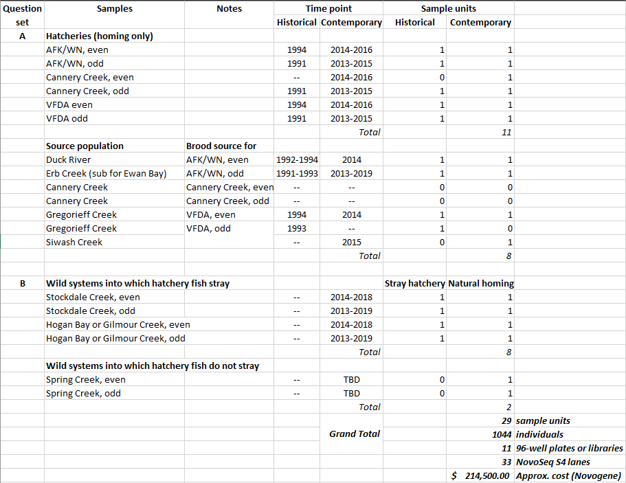

# Setup

Clean directory and load packages
```{r setup, include=FALSE}
rm(list=ls())

knitr::opts_chunk$set(echo = TRUE)

if(!require("pacman")) install.packages("pacman"); library(pacman)

pacman::p_load(
  tidyverse,
  lubridate,
  DT
)

# source("~/../R/Functions.GCL.R")  # develop branch!!!
```

# Objective

The objective of this notebooks is to update the extraction list for our collaborative PWS Pink Salmon whole genome re-sequencing (WGR) project with the Christie Lab at  Purdue University. The goal of this notebook is 2-fold:

  1) Reconcile and update the final list of fish in P076 (there was an error where PSPRIN14 replacement fish were not updated in iStrategy Wells table)  
  2) Join in *all* paired data from AHRP Pedigree collections (length, otolith mark id, location, parentage info?), and clarify that all PopStructure collections are upstream, not intertidal

# Background

This project is using leftover Pink Salmon Disaster 2016 funds to try to address questions about potential genetic mechanisms causing reduced RRS. This project is broken into two main questions:  

  * A - genomic evidence for domestication selection over time (comparing historical vs. contemporary vs. brood source collections)  
  * B - genomic differences between hatchery strays vs. natural-origin homing individuals

The study design for this extraction list comes from:

    V:\Documents\5_Coastwide\Multispecies\AHRP\Pink Salmon Disaster Funding\Round2\Objective 11 PWS WGR\Sample Units.xlsx
    Sheet 2

  * 29 sample units  
  * 36 individuals per samples unit  
  * 1,044 total individuals  

## Sample Units



Using "output/PWS Pink Salmon WGR Extraction List.xlsx" and "output/extraction_selection.xlsx" to hand-pick most extractions

# Reconcile P076 Fish

Read in the original and revised P076 Wells tables from *LOKI* iStrategy (internal ADF&G GCL database).
```{r}
(wells_original <- readr::read_csv(file = "../data/P076 for Sequencing_Wells_original_bad.csv"))
(wells_revised <- readr::read_csv(file = "../data/P076 for Sequencing_Wells_revised_good.csv"))
```

## How many different fish?

Fish that are the 12 fish with missing tissues that we did **not** end up using.
```{r}
dplyr::anti_join(
  x = dplyr::select(.data = wells_original, `Silly Code`, `Fish`),
  y = dplyr::select(.data = wells_revised, `Silly Code`, `Fish`)
)
```

Replacement 12 fish that got extracted and sequenced.
```{r}
dplyr::anti_join(
  x = dplyr::select(.data = wells_revised, `Silly Code`, `Fish`),
  y = dplyr::select(.data = wells_original, `Silly Code`, `Fish`)
)
```

## How about well locations?

We know that we had 12 fish replacements, but we need to check if these replacements changed the DNA plate map.

### What is wrong?

This is the **original** fish and well location info. These are **wrong**.
```{r}
dplyr::anti_join(x = wells_original, y = wells_revised)
```

### What is correct now?

These is the **revised** fish and well location info. This is the **correct** fish and well location data that should be used moving forward.
```{r}
dplyr::anti_join(x = wells_revised, y = wells_original)
```

## Conclusion

There were 12 fish that were originally selected for DNA extraction that had missing tissues. Those 12 fish were replaced and then prior to DNA extraction, the DNA plate map was re-sorted by Fish ID, so it resulted in 32 fish from collection PSRIN14 getting shifted into different wells. No other collections were affected, everything else is as it should be.

## Update `extraction_selection.xlsx` individuals tab

How many fish per silly?
```{r}
wells_revised %>% 
  dplyr::count(`Silly Code`)
```

Read in all PSPRIN14 extractions
```{r}
extraction_selection_PSPRIN14_PSPRIN15 <-
  readr::read_csv(file = "../output/extraction_selection_PSPRIN14_PSPRIN15.csv") %>% 
  dplyr::select(-dwp_barcode)
extraction_selection_PSPRIN14_v2 <-
  readr::read_csv(file = "../output/extraction_selection_PSPRIN14_v2.csv")
extraction_selection_PSPRIN14_v3 <-
  readr::read_csv(file = "../output/extraction_selection_PSPRIN14_v3.csv")

(
  extraction_PSRPIN14 <-
    dplyr::bind_rows(
      extraction_selection_PSPRIN14_PSPRIN15,
      extraction_selection_PSPRIN14_v2,
      extraction_selection_PSPRIN14_v3
    )
)
```

Join up with `wells_revised`
```{r}
(
  wells_revised %>%
    dplyr::filter(`Silly Code` == "PSPRIN14") %>%
    dplyr::rename(silly = "Silly Code",
                  fish_id = "Fish") %>%
    dplyr::select(silly, fish_id) %>%
    dplyr::left_join(extraction_PSRPIN14, by = c("silly", "fish_id")) %>%
    dplyr::select(silly, fish_id, sex, otolith_mark_present, sample_date) %>%
    dplyr::mutate(
      sex = dplyr::case_when(sex == "M" ~ "male",
                             sex == "F" ~ "female"),
      origin = dplyr::case_when(
        otolith_mark_present == "NO" ~ "natural",
        otolith_mark_present == "YES" ~ "hatchery",
        TRUE ~ otolith_mark_present
      )
    ) %>%
    dplyr::select(silly, fish_id, sex, origin, sample_date) %>%
    readr::write_csv(file = "../output/extraction_PSPRIN14_revised.csv")
)
```

# Paired data

## Read

### Location

Read in all `riverdist` output.
```{r}
(
  stream_specimens_riverdist_all_streams_2013_2020 <-
    readr::read_csv(file = "../data/stream_specimens_riverdist_all_streams_2013_2020.csv")
)
```

Reformat to get intertidal vs. upstream.
```{r}
(
  location_tidal <-
    stream_specimens_riverdist_all_streams_2013_2020 %>%
    dplyr::rename(sample = Sample,
                  distance_tide = dist2tide) %>%
    dplyr::mutate(
      intertidal = dplyr::case_when(
        distance_tide <= 0 ~ "Intertidal",
        distance_tide > 0 ~ "Upstream",
        is.na(distance_tide) ~  NA_character_
      )  # create intertidal
    ) %>%
    dplyr::select(sample, intertidal)
)
```

### Length + Otolith

```{r}
erb_2017 <-
  readr::read_csv(file = "../data/Erb 2017 AHRP Salmon Biological Data 20220321_151027.csv")
stockdale_2015_2016_hogan_2015_2016 <-
  readr::read_csv(file = "../data/Stockdale 2015-2016 Hogan 2015-2016 Spring 2014-2015 AHRP Salmon Biological Data 20220322_115608.csv")
spring_2014_2015 <-
  readr::read_csv(file = "../data/Spring 2014-2015 AHRP Salmon Biological Data 20220322_122538.csv")

(oceanak_og <- dplyr::bind_rows(erb_2017,
                               stockdale_2015_2016_hogan_2015_2016,
                               spring_2014_2015)
)
```

Reformat
```{r}
(
  oceanak <- oceanak_og %>%
    dplyr::filter(TISSUE_TYPE == "Heart-bulbus arteriosus") %>%
    dplyr::rename(
      silly = SILLY_CODE,
      fish_id = FISH_ID,
      tissue_type = TISSUE_TYPE,
      dwp_barcode = DNA_TRAY_CODE,
      dwp_well = DNA_TRAY_WELL_CODE,
      sample_date = SAMPLE_DATE,
      sex = SEX,
      length_mm_meh = LENGTH_MM,
      otolith_mark_present = OTOLITH_MARK_PRESENT,
      otolith_mark_id = OTOLITH_MARK_ID
    ) %>%
    dplyr::mutate(
      sample_date = lubridate::ymd(sample_date),
      hatchery = dplyr::case_when(
        !is.na(otolith_mark_id) ~ stringr::str_sub(
          string = otolith_mark_id,
          start = 1,
          end = 3
        ),
        TRUE ~ otolith_mark_id
      ),
      origin = dplyr::case_when(
        otolith_mark_present == "NO" ~ "natural",
        otolith_mark_present == "YES" ~ "hatchery"
      ),
      sex = dplyr::case_when(
        sex == "M" ~ "male",
        sex == "F" ~ "female",
        sex == "U" ~ "unknown",
        TRUE ~ sex
      )
    ) %>%
    tidyr::unite(
      col = "silly_source",
      c(silly, fish_id),
      sep = "_",
      remove = FALSE
    ) %>%
    tidyr::unite(
      col = "sample",
      c(dwp_barcode, dwp_well),
      sep = "_",
      remove = FALSE
    ) %>%
    dplyr::select(
      silly_source,
      sample,
      silly,
      fish_id,
      dwp_barcode,
      dwp_well,
      sample_date,
      sex,
      length_mm_meh,
      origin,
      otolith_mark_present,
      otolith_mark_id,
      hatchery
    )
)
```

## Join

Join in location data to the everything else from the data warehouse.
```{r}
(paired_data <- oceanak %>%
   dplyr::left_join(y = location_tidal, by = "sample"))
```

Now join this all in with the `wells_revised`
```{r}
wells_revised %>% 
  tidyr::unite(
      col = "silly_source",
      c("Silly Code", "Fish"),
      sep = "_",
      remove = FALSE
    ) %>%
  dplyr::left_join(y = paired_data, by = "silly_source") %>% 
  dplyr::filter(!is.na(sample))
```

Double check to make sure this is how many fish we should have...
```{r}
wells_revised %>% 
  dplyr::filter(`Silly Code` %in% c("PERB17", "PHOGAN15", "PHOGAN16", "PSPRIN14", "PSPRIN15", "PSTOCK15", "PSTOCK16"))
  dplyr::count(`Silly Code`)
```

Whew, we did it

# Read in `extraction_selection.xlsx` tab individuals

```{r}
(individuals <- readxl::read_xlsx(path = "../output/extraction_selection.xlsx", sheet = "individuals"))
```

We are going to replace this tab with a join between `wells_revised`, the existing `individuals` tab, and our new `paired data`
```{r}
(
  individuals_new <- wells_revised %>%
    dplyr::select(-`Lab Project ID`) %>%
    dplyr::rename(
      dna_plate_id = "Plate ID",
      silly = "Silly Code",
      fish_id = "Fish",
      dna_plate_well = "Well",
      tissue_type = "Tissue Type"
    ) %>%
    dplyr::select(dna_plate_id,
                  dna_plate_well,
                  silly,
                  fish_id,
                  tissue_type) %>%
    dplyr::left_join(y = individuals, by = c("silly", "fish_id")) %>%
    dplyr::left_join(
      y = select(.data = paired_data,-c(sex, origin, sample_date)),
      by = c("silly", "fish_id")
    )
)
```
Great, write all of this out, paste into `extraction_selection_revised_20221014.xlsx` as the new `individuals tab`, annotate the columns, send to Will.
```{r}
readr::write_csv(x = individuals_new, file = "../output/extraction_selection_revised_20221014.csv")
```

End...time for a beer